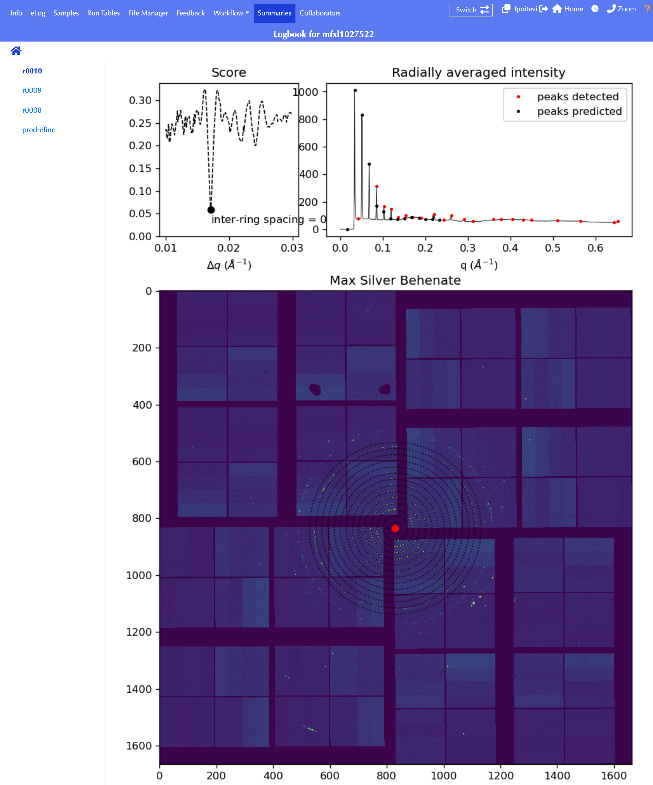

# SFX analysis toolkit {: #top}

<a name="toc"></a> **Jump to:**
- [`Running btx`](#btx)
- [`Running Cheetah`](#cheetah)
- [`Running Crystfel`](#crystfel)

---
## Automated SFX analysis with btx {: #btx}

### Setup `btx`
Ask your instrument scientist or data POC to setup `btx` in the eLog. They will essentially need to run something similar to the following:
```bash
(base) [fpoitevi@sdfiana002]$ setup_btx.sh -e mfxl1025422 -n 120 -r lcls:onshift2 -w sfx
```

Make sure that the `geometry_agbe` or `optimize_geometry` workflow is defined in the Workflow Definition tab as in the figure below.

|                                                                                                                                                | 
|:--------------------------------------------------------------------------------------------------------------------------------------------------------------------------------------------------------:| 
|                                                                                 __BTX workflow definition in the eLog.__                                                                                 |

This will also create a `btx` directory in the experiment scratch folder, at the following path: `/sdf/data/lcls/ds/mfx/mfxl1025422/scratch/btx`. At this point, the `btx` directory looks like:
```bash
(base) [fpoitevi@sdfiana002 btx]$ tree
.
├── launchpad
└── yamls
    └── config.yaml
```

A template configuration file has been created, starting with the lines below. `btx` will organize results under the `root_dir`. Make sure the rest of the parameters are to your liking.
```bash
setup:
  queue: 'milano'
  account: 'lcls:mfxl1025422'
  reservation: ''
  root_dir: '/sdf/data/lcls/ds/mfx/mfxl1025422/scratch/btx/'
  exp: 'mfxl1025422'
  run: 5
  det_type: 'Rayonix'
  cell: ''

elog_display:

fetch_mask:
  dataset: '/entry_1/data_1/mask' # Rayonix - switch to /data/data for other det

fetch_geom:

...
```


### Trigger Geometry optimization workflow in the eLog

Click on the Workflow Controls tab and trigger the workflow for the desired run.

|  | 
|:---------------------------------------------------------------:| 
|            __BTX workflow controls from the eLog.__             |

### Monitor results

The measured distance between sample and detector will eventually be reported in the Workflow controls tab. 

|  | 
|:-----------------------------------------------------------------------------------:| 
|                      __BTX reporting of geometry inferred from Silver Behenate run.__                       |

Fitting plots will can be found in the "Summaries" page (go to ***runs > r0010*** where 10 is the run number).


|  | 
|:-----------------------------------------------------------------------------------------:| 
|              __BTX summary of geometry inferred from Silver Behenate run.__               |

---
## Running Cheetah {: #cheetah}

### Launch Cheetah

0. ssh to psana interactive node on S3DF.
1. go to central installation directory: `cd /sdf/group/lcls/ds/tools/om`
2. source cheetah environment: `source setup-cheetah.sh`
3. launch the GUI: `cheetah_gui.py`

### Setup experiment

1. when prompted, create new experiment or open existing experiment by pointing to your experiment's scratch folder (e.g. `/sdf/data/lcls/ds/<instrument>/<experiment>/scratch`)
2. go to ***File > Unlock command operations***
3. go to ***File > Start crawler***
4. Profit!

|  | 
|:------------------------------:| 
|          __Cheetah.__          |


---
## Running Crystfel {: #crystfel}

### Launch Crystfel

0. ssh to psana interactive node on S3DF.
1. load the crystfel module: 
```bash
export MODULEPATH=$MODULEPATH:/sdf/group/lcls/ds/tools/crystfel/modulefiles
module load crystfel/0.10.2
crystfel
```

### Setup experiment

Load data and point to the run folder under Cheetah's hdf5 directory. Also point to the Cheetah geometry file.

|  | 
|:--------------------------------:| 
|          __Crystfel.__           |
